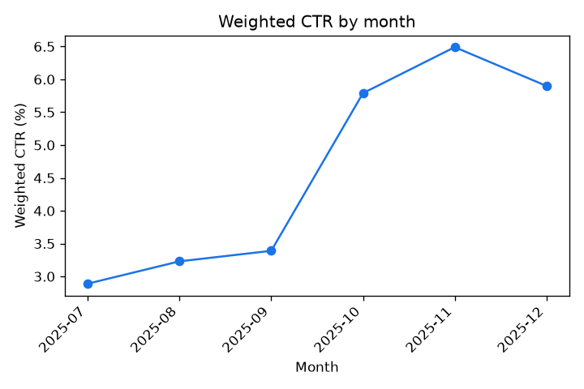
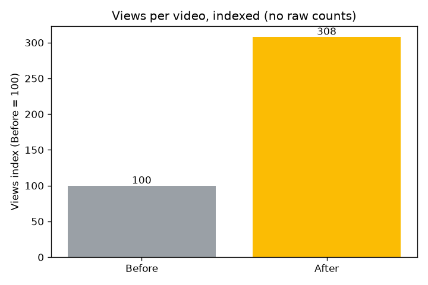

# 01 — Content Channel Analytics

> A self-directed before/after analysis of **a content channel's real performance data**. It measures the impact of a thumbnail/title change on click-through rate using an **impressions-weighted CTR** model in SQL + Power BI. **Rates and percentages only. No raw audience numbers appear anywhere in this repo.**


*Power BI dashboard (rates only): impressions-weighted CTR roughly doubled after a thumbnail/title change.*

## Problem

A channel's headline CTR is a simple average. It treats a video shown 200 times the same as one shown 200,000. After changing my thumbnail/title approach, I wanted an honest read on whether click-through rate *actually* improved, weighting each video by how often it was shown and accounting for the obvious confounds.

## Data

**Real** per-video analytics exports (raw exports git-ignored in `data/private/`). A tiny **synthetic** sample ([`data/sample_synthetic.csv`](data/sample_synthetic.csv), clearly labeled) ships so the pipeline runs out of the box. See [`data/README.md`](data/README.md) for the export steps and the privacy rules.

## Method

1. **Import** ([`import_to_sqlite.py`](import_to_sqlite.py)) — load the CSV into SQLite and tag each video **Before** / **After** a change date.
2. **Query** ([`queries/`](queries/)) — 11 commented SQL files. The core idea is **impressions-weighted CTR**: `SUM(impressions × ctr) / SUM(impressions)`, so heavily-shown videos count proportionally. Views and subscribers are reported as **indexes (Before = 100)**, so the relative lift shows without any raw count.
3. **Chart** ([`analysis.ipynb`](analysis.ipynb)) — matplotlib charts of CTR %, the monthly trend, and the views index. Percentages only.

On the bundled synthetic sample, weighted CTR runs ~3.2% → ~6.1% — that just *illustrates the method* so the code runs out of the box. The real result is in **Findings** below, in rate terms.

### Charts (generated from the synthetic sample)





## Findings

After I changed my thumbnail-and-title approach, **impressions-weighted CTR roughly doubled — from about 3.5% to about 6.9%, a ~96% lift** (the headline from my Power BI model, reported in rates only). The weighting matters: a plain average would let a few low-reach videos distort the picture, whereas weighting by impressions reflects what audiences actually did across the videos that were shown most.

I treat this as a strong signal, not a clean experiment, and I'd flag the confounds honestly when presenting it to leadership or stakeholders:

- the before/after split was **data-detected** (I found the inflection point in the data), not pre-registered — so the split date is itself part of the finding;
- a **viral outlier** can pull averages up; impressions-weighting tempers that, but it's worth isolating;
- my **upload volume** changed across the window, which shifts how much each period contributes;
- an **AI-launch seasonality** bump landed around the same time and may share the credit.

Net: the packaging change plausibly drove a meaningful CTR improvement, and the impressions-weighted model is the honest way to size it. Raw view, impression, and subscriber counts are kept private — this repo is rates-only by design.

## How to run

```bash
pip install -r requirements.txt
python import_to_sqlite.py     # builds the SQLite database from the synthetic sample
python run_queries.py          # prints all 11 query results (rates only)
# optional notebook (needs jupyter): pip install -r requirements-dev.txt && jupyter notebook analysis.ipynb
```

## Privacy guardrails (enforced)

- **No raw views / impressions / subscriber counts** appear in any committed file or screenshot — every query and chart outputs rates, percentages, or indexes (Before = 100).
- A test ([`tests/test_pipeline.py`](tests/test_pipeline.py)) **fails the build if any query ever returns a raw-count column**.
