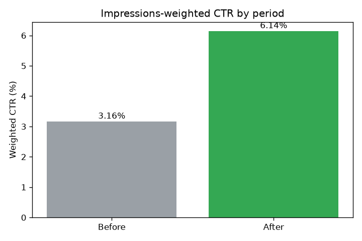

# 01 — YouTube Channel Analytics ⭐ (flagship)

> A self-directed before/after analysis of **real YouTube channel performance data** (the specific channel is kept private). It measures the impact of a thumbnail/title change on click-through rate using an **impressions-weighted CTR** model in SQL + Power BI. **Rates and percentages only — no raw audience numbers appear anywhere in this repo.**


`>>> CHRISTOPHER:` confirm this is the screenshot you want public (verified privacy-safe — it shows rates only). Swap it any time.

## Problem

YouTube's headline CTR is a simple average — it treats a video shown 200 times the same as one shown 200,000. After changing my thumbnail/title approach, I wanted an honest read on whether click-through rate *actually* improved, weighting each video by how often it was shown and accounting for the obvious confounds — **without publishing any private audience numbers.**

## Data

**Real** YouTube Studio per-video exports (channel kept private; raw exports git-ignored in `data/private/`). A tiny **synthetic** sample ([`data/sample_synthetic.csv`](data/sample_synthetic.csv), clearly labeled) ships so the pipeline runs out of the box. See [`data/README.md`](data/README.md) for the export steps and the privacy rules.

## Method

1. **Import** ([`import_to_sqlite.py`](import_to_sqlite.py)) — load the CSV into SQLite and tag each video **Before** / **After** a change date.
2. **Query** ([`queries/`](queries/)) — 11 commented SQL files. The core idea is **impressions-weighted CTR**: `SUM(impressions × ctr) / SUM(impressions)`, so heavily-shown videos count proportionally. Views and subscribers are reported as **indexes (Before = 100)**, so the relative lift shows without any raw count.
3. **Chart** ([`analysis.ipynb`](analysis.ipynb)) — matplotlib charts of CTR %, the monthly trend, and the views index. Percentages only.

On the synthetic sample, weighted CTR runs ~3.2% → ~6.1% — that just *illustrates the method*; your real figures are yours to report, in rate terms.

### Charts (generated from the synthetic sample)




## Findings

`>>> CHRISTOPHER:` Run it on your real export and write your read here, **in rate terms only** (e.g. "weighted CTR roughly doubled; ~3× views per video"). Address the honest confounds so it reads like analysis, not a brag:

> - the before/after split was **data-detected**, not pre-registered
> - one **viral outlier** can swing averages — note how you handled it
> - **upload volume** changed across the window
> - an **AI-launch seasonality** bump landed around the same time
>
> Keep absolute numbers OUT of this file — they go in your private one-pager.

## How to run

```bash
pip install -r requirements.txt
python import_to_sqlite.py     # builds data/youtube.db from the synthetic sample
python run_queries.py          # prints all 11 query results (rates only)
# optional notebook (needs jupyter): pip install -r requirements-dev.txt && jupyter notebook analysis.ipynb
```

## Privacy checklist (before you ever push)

- [ ] No raw views / impressions / subscriber counts in any committed file or screenshot
- [ ] Real exports live only in `data/private/` (git-ignored)
- [ ] Absolute numbers only in your git-ignored private one-pager
