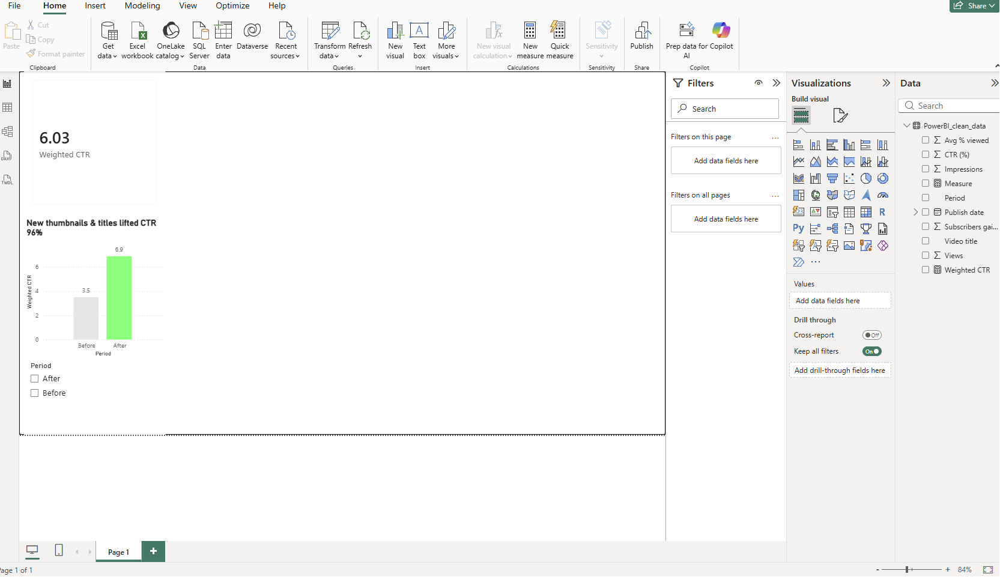

# Data Analytics Portfolio — Christopher Kokoski

Hands-on data-analysis projects in **SQL, Power BI, and Python**, built while completing the Google Data Analytics Professional Certificate.

> **About me:** I spent 5 years in marketing technology at a healthcare system, turning campaign and engagement data into decisions with SFMC, GA4, Looker Studio, and Excel. I'm now focused on data-analyst roles — where asking the right question, getting the data honest, and making it legible is the whole job.

## Privacy note

The flagship project uses **real** channel data, so the whole repo follows one rule: **rates and percentages are public; raw counts are private.** You'll see CTR %, % change, and indexes — never raw views, impressions, subscribers, or revenue. My absolute figures live in a private one-pager I walk through in interviews.

## Skills

| Skill | Where I've used it | Self-rating\* |
|-------|--------------------|---------------|
| SQL | YouTube + Email Marketing projects here; SFMC data extensions | Working |
| Power BI | YouTube flagship (custom DAX) + Healthcare dashboard here | Working |
| Python | pandas / SQLite / matplotlib tooling here; Google DA Certificate | Working |
| Excel | 5 yrs marketing reporting; the bonus pivot engine here | Proficient |
| Looker Studio | 5 yrs marketing dashboards | Proficient |
| GA4 | 5 yrs web & campaign analytics | Working |

\* Self-ratings reflect current working proficiency; I'm deepening SQL and Power BI through these projects and the Google Data Analytics Certificate.

## Projects

| # | Project | The value | Status |
|---|---------|-----------|--------|
| 01 ⭐ | [YouTube Channel Analytics](01-youtube-channel-analytics/) | An impressions-weighted before/after model measured a **~96% lift in click-through rate** after a creative redesign — rates only, channel kept private | ✅ |
| 02 | [Email Marketing Analytics (SQL)](02-email-marketing-sql/) | 14 business-question SQL queries turning engagement logs into deliverability, re-engagement, and list-health recommendations | ✅ |
| 03 | [Healthcare Quality Dashboard (Power BI)](03-healthcare-quality-powerbi/) | Public CMS hospital-quality data cleaned and modeled, with insights on rating coverage and geography *(dashboard build in progress)* | ✅ |

**Bonus (range pieces — not headliners):** [Excel Pivot Engine](bonus/excel-pivot-engine/) · [Data Quality Toolkit](bonus/data-quality-toolkit/)

## How this portfolio was built

Built with an **AI-assisted development workflow** — the same human-directs-AI approach I spent five years building in marketing technology, shown openly rather than hidden. I set the direction, the analytical questions, and the privacy rules, and I stand behind the conclusions; AI did the heavy lifting on scaffolding, code, documentation, and first-draft analysis that I review and own.

Every dataset here is **public** (sourced + licensed) or **clearly-labeled synthetic**, except the flagship's **real** YouTube data — presented in rates only, channel kept private. The flagship's ~96% CTR-lift headline is my own prior Power BI analysis; the synthetic and public-data write-ups are worked analyses of the included demo / open data, not real-world client results.

## Links

- **MarTech portfolio:** https://github.com/Ckokoski/martech-portfolio
